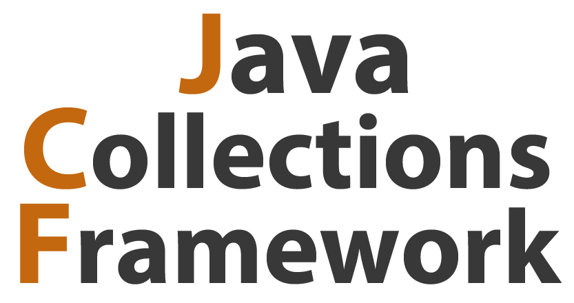

# Проект Tracker 
> Описание проекта.

## Технологии и инструменты:

Краткое описание проекта.

## Лицензия
	
[MIT. Free Software!](https://github.com/ViktorJava/job4j/tree/master/LICENSE)

---

>e-mail:[gmail.com](mailto:gipsyscrew@gmail.com) &nbsp;&middot;&nbsp;
>fb:[Facebook.com](https://www.facebook.com/viktor.vdovichenko) &nbsp;&middot;&nbsp;
> GitHub:[@ViktorJava](https://github.com/ViktorJava) &nbsp;&middot;&nbsp;
> OK:[Odnoklassniki](https://ok.ru/profile/571539586668)

